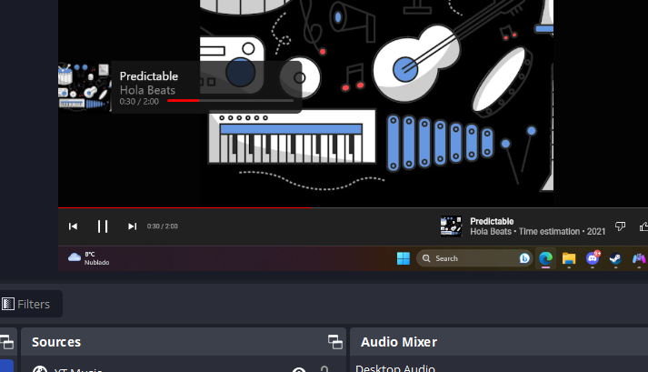

# Youtube Music OBS Overlay
An overlay for OBS that allows you to display your currently playing song on Youtube Music.
You have to use a chrome extension to get the song data from Youtube Music. The extension will send the data to a local server written in Go. The server has three routes (two are endpoints):
- **GET** `/` - The index page. This returns the HTML for the overlay.
- **POST** `/` - The endpoint that the chrome extension will send the song data to.
- **GET** `/sse` - The endpoint that the overlay will use to get the song data from the server. This uses Server-Sent Events to send the data to the overlay.

## How to use
1. Install the chrome extension loading the `extension` folder as an unpacked extension. (You have to enable developer mode to do this)
2. Go to `backend` folder and run the server using `go run main.go` or `go build main.go` and then running the executable.
3. Add a browser source to OBS and set the URL to `http://localhost:8080/`. (You can change the port using the `-port` flag or change the default port in the code)
4. Open Youtube Music and toggle extension by clicking on the extension icon in the top right of the browser.

Tested on Microsoft Edge (Version 114.0.1823.79 (Official build) (64-bit)) in Windows 11

